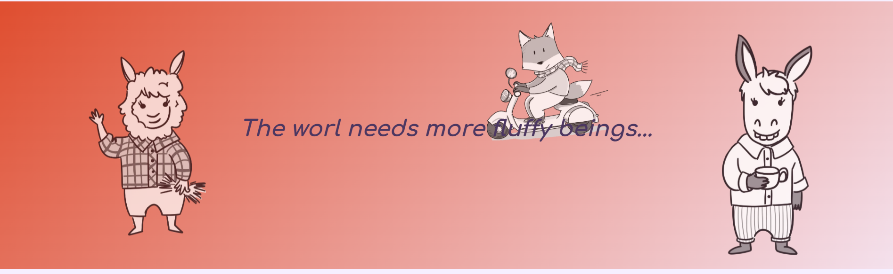
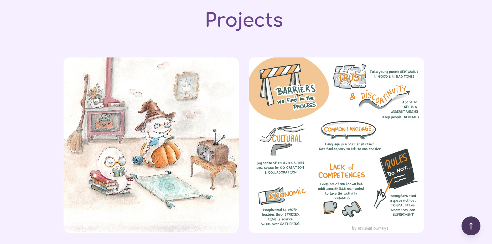
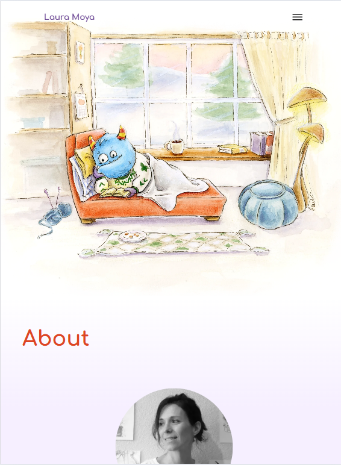

🔗 Live site:  
https://laumoyaa-svg.github.io/lauramoya-portfolio-2026/

---

# Laura Fernandez de Moya – Illustration Portfolio (2026)

## Description and purpose

This is the first version of my illustration portfolio.

The goal of this project is to create a simple, clean, and personal space to showcase my visual work. It is conceived as an evolving project, a starting point to experiment with composition, digital illustration, and visual storytelling in a web format.

Rather than building something complex, the focus was on clarity, atmosphere, and presenting illustrations in a direct and honest way.

---

## Concept, palette & inspiration

For a deeper understanding of the visual direction behind this portfolio — including color palette decisions, references, and conceptual inspiration — see:

📎 [`project-brief.md`](./project-brief.md)

This document outlines the aesthetic intentions, mood, and visual references that informed the website.

---


## Points of Improvement
The website is not well adapted to a mobile version. Efforts were made to make it responsive, and Copllot assistance didn't actually solve anything. 
This issue will be reviewed and improved in future versions of the portfolio, since anyway the general layout is intended to change. 

---

## Tech stack

- HTML5  
- CSS3  
- Git & GitHub  
- GitHub Pages (deployment)

This is a static website with no frameworks — intentionally lightweight and easy to maintain.

---

## Local development setup

If you want to run this project locally:

1. Clone the repository:
   ```bash
   git clone https://github.com/laumoyaa-svg/lauramoya-portfolio-2026.git
   ```

2. Open the project folder.

3. Open `index.html` in your browser.

No dependencies or installations are required.

---

## Demo

Some example views of the site:

- Desktop – landing and hero section  
   

- Desktop – projects section  
   

- Mobile – landing page  
   

---

## Credits & acknowledgements

Illustrations and design by Laura Moya.

Built within the fram of the subject ' Ilustración Aplicada: Productos Analógicos y Digitales (2026), Illustration Master UDIT 2026'.

Point of reference: 
https://ruvebal.github.io/web-atelier-udit/tracks/es/ilustracion-webapp/portfolio-challenge/#9-footer

Thanks to Ruben Vega for the  templates and the knowledge acquired in the process.

## 📁 Structure of the Project

```
laura-project-template-v2/
├── 404.html
├── index.html                       # Portfolio scrollytelling principal
├── GETTING-STARTED.md
├── README.md
├── project-brief.md                 # 🔑 Fuente de verdad del concepto
├── project-inspiration.md           # Referencias visuales
├── project.yaml
├── LICENSE-CODE
├── LICENSE-CONTENT
├── package.json
├── assets/
│   ├── css/
│   │   ├── _variables.css           # Tokens de diseño (colores, tipografías...)
│   │   ├── _reset.css
│   │   ├── _base.css
│   │   ├── _layout.css
│   │   ├── _components.css
│   │   ├── _scrollytelling.css      # Secciones de historia + parallax
│   │   ├── _utilities.css
│   │   ├── _accessibility.css
│   │   ├── _responsive.css          # Breakpoints y ajustes móviles
│   │   ├── _print.css
│   │   └── style.css                # Entrada única que importa todos los módulos
│   ├── js/
│   │   └── main.js                  # Navegación, scrollytelling, utilidades
│   ├── images/                      # Ilustraciones y recursos gráficos
│   ├── partials/                    # header.html, footer.html
│   ├── portfolio/                   # Contenidos de bio y statement
│   └── screenshots/                 # Capturas para documentación
├── docs/                            # Documentación y prompts de IA
│   ├── AI-METHODOLOGY-REMINDER.md
│   ├── ejemplo-contexto-archivos.md
│   ├── ejemplo-navegacion.md
│   ├── ejemplo-prompt-portfolio-challenge.md
│   └── plan1-ia.md
├── editorial/                       # Página de proyectos editoriales
│   └── index.html
├── educational/                     # Página de proyectos educativos
│   └── index.html
└── projects/                        # (Reservado para futuros proyectos)
```